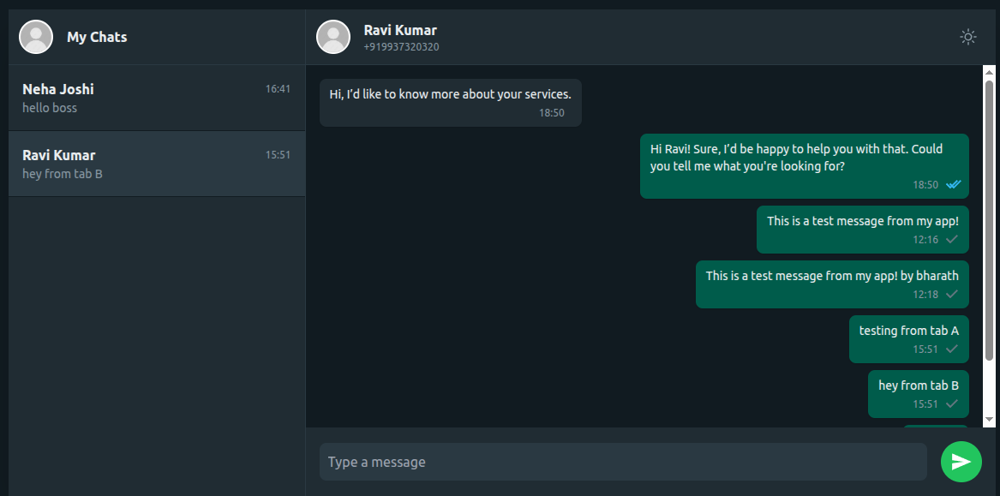

# WhatsApp Web Clone - Full Stack Evaluation Project

This project is a full-stack, real-time chat application built as an evaluation task for a Full Stack Developer role. It simulates the core functionality of WhatsApp Web, processing and displaying chat conversations from webhook data. The application features a fully responsive frontend, a robust backend API, and real-time communication using WebSockets.

## 🔴 Live Demo

*   **Frontend (Vercel):** **[YOUR_FRONTEND_URL_HERE]**
*   **Backend (Render):** **[YOUR_BACKEND_URL_HERE]**

## ✨ Screenshot


*(A screenshot of the application showcasing both the chat list and a conversation in dark mode)*

## 🚀 Features

This application implements all the core requirements of the assignment, plus several bonus features to enhance the user experience and demonstrate advanced skills.

- **Real-time Chat Interface:** A responsive UI that closely mimics the look and feel of WhatsApp Web.
- **Webhook Data Processing:** Backend script to seed the database from sample JSON webhook payloads.
- **Grouped Conversations:** The main view displays all conversations, neatly grouped by user.
- **Full Chat History:** Clicking a conversation displays the complete message history, sorted by time.
- **Message Status Indicators:** Sent messages display status ticks for `sent`, `delivered`, and `read`.
- **Demo Message Sending:** Users can send new messages which are saved to the database and broadcast in real-time.

### 🌟 Bonus Features Implemented

- **Real-time Updates with WebSockets:** New messages appear instantly across all connected clients without needing a refresh, thanks to `socket.io`.
- **Responsive Mobile View:** A dedicated mobile layout that shows the chat list and chat window as separate, full-screen views for a native-app feel.
- **Dark/Light Theme Toggle:** A theme switcher with a polished UI that saves the user's preference in `localStorage`.
- **Refined UI & Custom Icons:** The UI has been enhanced with a custom dark-mode color palette, improved icons, and better layout details.

## 🛠️ Tech Stack

The project is built with a modern, professional full-stack tech stack.

| Frontend                               | Backend                                  |
| -------------------------------------- | ---------------------------------------- |
| **React.js** (with Vite)               | **Node.js**                              |
| **Tailwind CSS**                       | **Express.js**                           |
| **`socket.io-client`** for WebSockets  | **MongoDB** (with Mongoose)              |
| **`axios`** for API requests           | **`socket.io`** for WebSockets           |

## 🔌 API Endpoints

The backend provides the following RESTful API endpoints.

### Get All Conversations

- **Endpoint:** `GET /api/conversations`
- **Description:** Retrieves a list of all unique conversations. Each conversation object includes the user's information and the last message sent in that chat for preview purposes.
- **Success Response (200):**
  ```json
  [
    {
      "wa_id": "929967673820",
      "name": "Neha Joshi",
      "lastMessage": "Hi Neha! Absolutely. We offer curated home decor pieces...",
      "lastMessageTimestamp": "2025-08-06T12:17:10.000Z"
    },
    {
      "wa_id": "919937320320",
      "name": "Ravi Kumar",
      "lastMessage": "Hi Ravi! Sure, I’d be happy to help you with that...",
      "lastMessageTimestamp": "2025-08-06T12:00:20.000Z"
    }
  ]
  Get Messages for a Specific User
Endpoint: GET /api/messages/:wa_id
Description: Retrieves the full message history for a single conversation, identified by the user's wa_id. Also returns the user's information.
Success Response (200):
code
Json
{
  "userInfo": {
    "name": "Ravi Kumar",
    "wa_id": "919937320320"
  },
  "messages": [
    {
      "_id": "689a...",
      "message_id": "wamid.HBgMOTE...",
      "wa_id": "919937320320",
      "body": "Hi, I’d like to know more about your services.",
      "from_me": false,
      "status": "delivered",
      "timestamp": "2025-08-06T12:00:00.000Z",
      "createdAt": "...",
      "updatedAt": "..."
    }
  ]
}
Send a New Message (Demo)
Endpoint: POST /api/messages
Description: Creates and saves a new message to the database. This simulates sending a message from the application user. After saving, a WebSocket event ('newMessage') is emitted to all clients.
Request Body:
code
Json
{
  "wa_id": "919937320320",
  "body": "This is a test message from my app!"
}
Success Response (201):
code
Json
{
  "_id": "689b...",
  "message_id": "demo-689b...",
  "wa_id": "919937320320",
  "body": "This is a test message from my app!",
  "from_me": true,
  "status": "sent",
  "timestamp": "2025-08-08T14:30:00.000Z",
  "createdAt": "...",
  "updatedAt": "..."
}
⚙️ Local Development Setup
To run this project on your local machine, please follow these steps:
Prerequisites
Node.js (v20.x or higher recommended)
npm (Node Package Manager)
A free MongoDB Atlas account for the database.
Backend Setup
Navigate to the backend directory:
code
Bash
cd backend
Create the environment file:
Create a .env file in the backend directory and add your MongoDB connection string:
code
Code
MONGO_URI=your_mongodb_connection_string_here
PORT=5001
Install dependencies:
code
Bash
npm install
Seed the database:
This script will populate your MongoDB database with the sample chat data.
code
Bash
npm run seed
Start the development server:
code
Bash
npm run dev
The backend API will be running on http://localhost:5001.
Frontend Setup
Navigate to the frontend directory:
code
Bash
cd frontend
Install dependencies:
code
Bash
npm install
Start the development server:
code
Bash
npm run dev
The React application will open on http://localhost:5173 (or another available port). API requests from the frontend are automatically proxied to the backend thanks to the vite.config.js setup.
🚢 Deployment
This project is deployed in two parts, following modern best practices for full-stack applications:
Backend (Node.js API): Deployed as a Web Service on Render. The Root Directory is set to /backend, and the MONGO_URI is configured as a secret environment variable.
Frontend (React App): Deployed as a static site on Vercel. The Root Directory is set to /frontend, and the VITE_API_URL environment variable is configured to point to the live Render backend URL.
This separation ensures scalability, performance, and follows a professional CI/CD pipeline where pushes to the main branch trigger automatic redeployments.
Author: Bharath Simhadri
